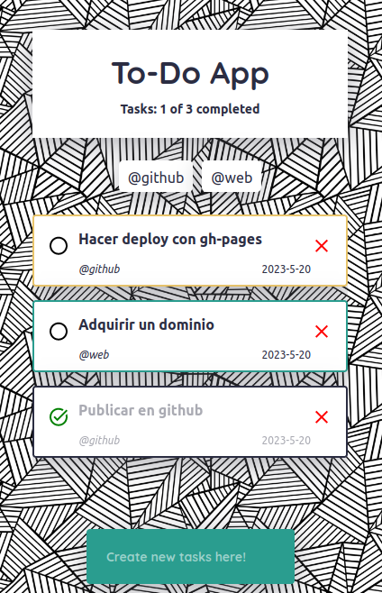

# 👉 To-Do app

- Esta es una simple aplicación de prueba con la cual aprendí sobre React.

# 👉 Features

Probablemente no tenga la mejor UX, pero si tiene algunas features como:

- Busqueda en una lista en base a la barra de input.
- Creación\/Eliminación de una nuevas tareas.
- Asignación de prioridad y tag por tarea.

# 👉 Preview

- ✨ [Live preview](https://evillalobosa.github.io/react18-todo-app/)

